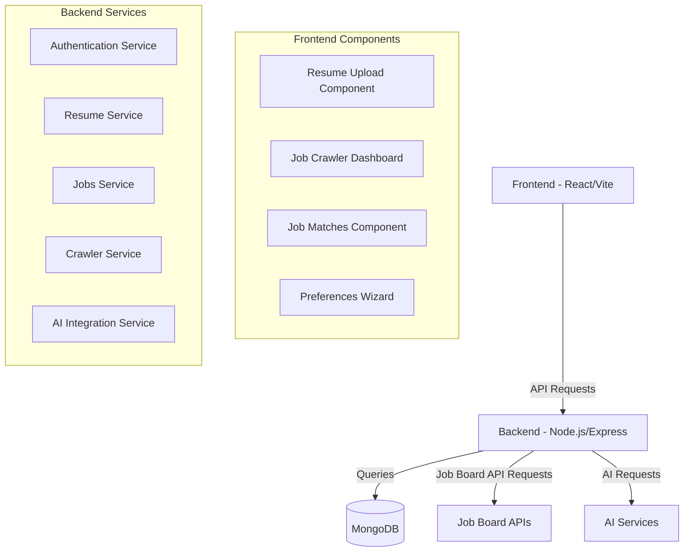

# System Analysis and Diagnostic Plan for Recruitment Platform

## 1. Executive Summary

This document outlines a comprehensive system analysis and diagnostic plan for the recruitment platform, focusing on identified issues with the job board crawling feature and potential failure points in the resume upload system with AI analysis capabilities. The plan includes a detailed architecture analysis, identification of potential failure points, and a systematic approach for testing and implementing robust error handling across the system.

## 2. Current Architecture Analysis

### 2.1 Overall System Architecture

The recruitment platform follows a modern web application architecture with the following components:



### 2.2 Key Components and Their Interactions

#### Frontend Components:
- **Resume Upload Component**: Handles file uploads and displays parsed resume data
- **Job Crawler Dashboard**: UI for managing job crawls and viewing results
- **Job Matches Component**: Displays job matches based on user preferences and resume
- **Preferences Wizard**: Guides users to set up job matching preferences

#### Backend Services:
- **Authentication Service**: Handles user authentication and authorization
- **Resume Service**: Processes resume uploads, parsing, and storage
- **Jobs Service**: Manages job data and matching algorithms
- **Crawler Service**: Handles job board crawling operations
- **AI Integration Service**: Integrates with AI providers for resume parsing and job matching

### 2.3 Data Flow Analysis

#### Resume Upload Flow:
1. User uploads resume file (PDF/DOCX) via frontend
2. File is sent to backend via multipart form data
3. Backend validates file type and size
4. File content is extracted using pdf-parse or mammoth libraries
5. Text is parsed using regex or AI services
6. Structured data is stored in MongoDB
7. Results are returned to frontend

#### Job Crawling Flow:
1. User initiates crawl via Job Crawler Dashboard
2. Request is sent to backend API
3. Backend validates request parameters
4. Crawler service initiates job board API requests or web scraping
5. Results are processed and deduplicated
6. Jobs are stored in MongoDB
7. Crawl status and results are returned to frontend

## 3. Identified Issues with Job Crawling Feature

Based on error logs and system behavior, the following issues have been identified with the job crawling feature:

### 3.1 API Endpoint Issues

```
[ERROR] Error getting job by ID crawl:
CastError: Cast to ObjectId failed for value "crawl" (type string) at path "_id" for model "Job"
```

- The system is attempting to interpret route parameters like "crawl" and "schedule" as MongoDB ObjectIDs
- API endpoints return 404 (Not Found) and 403 (Forbidden) status codes
- Frontend shows "Failed to start crawl. Please try again." message

### 3.2 Route Configuration Issues

- GET http://localhost:5000/api/jobs/crawl 404 (Not Found)
- GET http://localhost:5000/api/jobs/schedule 404 (Not Found)
- GET http://localhost:5000/api/jobs/crawl/history 403 (Forbidden)
- POST http://localhost:5000/api/jobs/crawl 403 (Forbidden)

### 3.3 Database Model Issues

- CastError exceptions indicate a mismatch between expected and actual data types
- The system is trying to query the Job model with non-ObjectID values

## 4. Potential Failure Points in Resume Upload System

### 4.1 File Processing Failures

- **File Type Validation**: Limited to PDF and DOCX formats
- **File Size Limitations**: 5MB limit may be insufficient for some resumes
- **Text Extraction**: pdf-parse and mammoth libraries may fail with certain file formats or corrupted files

### 4.2 AI Integration Failures

- **API Connectivity**: External AI services may be unavailable or have rate limits
- **API Key Management**: Missing or invalid API keys
- **Response Parsing**: AI services may return unexpected response formats
- **Timeout Issues**: AI processing may exceed request timeout limits

### 4.3 Data Processing Failures

- **Text Parsing**: Regex-based parsing may fail with non-standard resume formats
- **Data Extraction**: Structured data extraction may miss important information
- **Error Handling**: Insufficient error handling during parsing process

## 5. Potential Failure Points in Job Board Crawling Feature

### 5.1 API Route Configuration Issues

- **Route Parameter Handling**: Confusion between route parameters and MongoDB ObjectIDs
- **Route Registration**: Routes may not be properly registered or may have conflicts
- **Middleware Configuration**: Authentication or validation middleware may be blocking requests

### 5.2 Job Board Integration Issues

- **API Authentication**: Missing or invalid API credentials for job boards
- **Rate Limiting**: Job board APIs may impose rate limits
- **Response Parsing**: Changes in API response formats may break parsing logic
- **Web Scraping Reliability**: Web scraping approaches may break with website changes

### 5.3 Database Operation Issues

- **Schema Validation**: Data may not conform to expected schema
- **Query Performance**: Inefficient queries may cause timeouts
- **Connection Issues**: Database connection problems may cause operation failures

## 6. Detailed Diagnostic Plan

### 6.1 API Route Configuration Diagnosis

1. **Verify Route Registration**:
   - Examine route registration in backend/src/index.js or similar entry point
   - Ensure all job-related routes are properly registered
   - Check for route conflicts or ordering issues

2. **Analyze Route Parameter Handling**:
   - Review route definitions in backend/src/jobs/jobs.controller.js
   - Identify how route parameters are extracted and used
   - Check for confusion between route parameters and MongoDB ObjectIDs

3. **Test API Endpoints Directly**:
   - Use tools like Postman or curl to test API endpoints directly
   - Verify authentication requirements
   - Test with various input parameters

### 6.2 Database Model Diagnosis

1. **Review Model Definitions**:
   - Examine model definitions in backend/src/models/
   - Verify schema definitions for Job, CrawlJob, and related models
   - Check ID field types and validation rules

2. **Analyze Query Operations**:
   - Review query operations in backend/src/jobs/services/job-service.js
   - Identify how IDs are used in queries
   - Check for type conversion issues

3. **Test Database Operations Directly**:
   - Use MongoDB shell or GUI tools to query the database directly
   - Verify data structure and integrity
   - Test queries with various parameters

### 6.3 Job Crawler Service Diagnosis

1. **Review Crawler Implementation**:
   - Examine backend/src/jobs/services/crawler-service.js
   - Verify error handling in crawl operations
   - Check for race conditions or concurrency issues

2. **Analyze Job Board Integrations**:
   - Review backend/src/jobs/integrations/
   - Verify API credentials and configuration
   - Check error handling in integration code

3. **Test Crawler Operations in Isolation**:
   - Create test scripts to run crawler operations directly
   - Monitor resource usage during crawling
   - Verify results are properly stored

### 6.4 Resume Upload System Diagnosis

1. **Review File Processing Implementation**:
   - Examine backend/src/resumes/utils/file-utils.js
   - Verify error handling in file processing
   - Test with various file formats and sizes

2. **Analyze AI Integration**:
   - Review backend/src/resumes/services/ai-service.js
   - Verify API credentials and configuration
   - Check error handling in AI integration code

3. **Test Resume Processing in Isolation**:
   - Create test scripts to run resume processing directly
   - Monitor resource usage during processing
   - Verify results are properly stored

## 7. Recommended Approach for Robust Error Handling

### 7.1 Centralized Error Handling

1. **Create Error Types**:
   ```javascript
   // backend/src/utils/errors.js
   class AppError extends Error {
     constructor(message, statusCode, errorCode) {
       super(message);
       this.statusCode = statusCode;
       this.errorCode = errorCode;
       this.isOperational = true;
       Error.captureStackTrace(this, this.constructor);
     }
   }
   
   class ValidationError extends AppError {
     constructor(message, errorCode = 'VALIDATION_ERROR') {
       super(message, 400, errorCode);
     }
   }
   
   class AuthenticationError extends AppError {
     constructor(message, errorCode = 'AUTHENTICATION_ERROR') {
       super(message, 401, errorCode);
     }
   }
   
   class NotFoundError extends AppError {
     constructor(message, errorCode = 'NOT_FOUND_ERROR') {
       super(message, 404, errorCode);
     }
   }
   
   // Export error classes
   module.exports = {
     AppError,
     ValidationError,
     AuthenticationError,
     NotFoundError
   };
   ```

2. **Implement Global Error Handler**:
   ```javascript
   // backend/src/middleware/error-handler.js
   const { AppError } = require('../utils/errors');
   const logger = require('../utils/logger');
   
   const errorHandler = (err, req, res, next) => {
     // Log error
     logger.error(`${err.name}: ${err.message}`, { 
       stack: err.stack,
       path: req.path,
       method: req.method,
       body: req.body,
       params: req.params,
       query: req.query
     });
     
     // Handle operational errors
     if (err.isOperational) {
       return res.status(err.statusCode).json({
         status: 'error',
         code: err.errorCode,
         message: err.message
       });
     }
     
     // Handle Mongoose validation errors
     if (err.name === 'ValidationError') {
       const errors = Object.values(err.errors).map(val => val.message);
       return res.status(400).json({
         status: 'error',
         code: 'VALIDATION_ERROR',
         message: 'Invalid input data',
         details: errors
       });
     }
     
     // Handle Mongoose cast errors
     if (err.name === 'CastError') {
       return res.status(400).json({
         status: 'error',
         code: 'INVALID_ID',
         message: `Invalid ${err.path}: ${err.value}`
       });
     }
     
     // Handle duplicate key errors
     if (err.code === 11000) {
       const field = Object.keys(err.keyValue)[0];
       return res.status(400).json({
         status: 'error',
         code: 'DUPLICATE_KEY',
         message: `Duplicate value for ${field}: ${err.keyValue[field]}`
       });
     }
     
     // Handle unknown errors in production
     if (process.env.NODE_ENV === 'production') {
       return res.status(500).json({
         status: 'error',
         code: 'INTERNAL_SERVER_ERROR',
         message: 'Something went wrong'
       });
     }
     
     // Send detailed error in development
     return res.status(500).json({
       status: 'error',
       code: 'INTERNAL_SERVER_ERROR',
       message: err.message,
       stack: err.stack
     });
   };
   
   module.exports = errorHandler;
   ```

3. **Register Error Handler**:
   ```javascript
   // In app.js or index.js
   const express = require('express');
   const errorHandler = require('./middleware/error-handler');
   
   const app = express();
   
   // ... other middleware and route registration
   
   // Register error handler (must be after routes)
   app.use(errorHandler);
   ```

### 7.2 Route-Level Error Handling

1. **Implement Async Handler Wrapper**:
   ```javascript
   // backend/src/utils/async-handler.js
   const asyncHandler = fn => (req, res, next) => {
     Promise.resolve(fn(req, res, next)).catch(next);
   };
   
   module.exports = asyncHandler;
   ```

2. **Use Async Handler in Controllers**:
   ```javascript
   // Example usage in controller
   const asyncHandler = require('../utils/async-handler');
   const { NotFoundError } = require('../utils/errors');
   
   const getJobById = asyncHandler(async (req, res) => {
     const { id } = req.params;
     
     const job = await Job.findById(id);
     
     if (!job) {
       throw new NotFoundError(`Job not found with id: ${id}`);
     }
     
     res.status(200).json(job);
   });
   ```

### 7.3 Service-Level Error Handling

1. **Implement Try-Catch in Service Methods**:
   ```javascript
   // Example in crawler-service.js
   async function startCrawl(options = {}) {
     try {
       // ... implementation
     } catch (error) {
       logger.error(`Error in job crawl:`, error);
       
       // Rethrow with additional context
       if (error.name === 'ValidationError') {
         throw new ValidationError(`Invalid crawl parameters: ${error.message}`);
       }
       
       if (error.name === 'AuthenticationError') {
         throw new AuthenticationError(`Failed to authenticate with job board: ${error.message}`);
       }
       
       // Generic error
       throw new AppError(`Failed to start crawl: ${error.message}`, 500, 'CRAWL_ERROR');
     }
   }
   ```

### 7.4 Frontend Error Handling

1. **Implement API Error Handling**:
   ```javascript
   // frontend/src/api.js
   async function apiRequest(endpoint, options = {}) {
     try {
       const response = await fetch(`${API_BASE_URL}${endpoint}`, {
         ...options,
         headers: {
           'Content-Type': 'application/json',
           ...getAuthHeaders(),
           ...options.headers
         }
       });
       
       if (!response.ok) {
         const errorData = await response.json().catch(() => ({}));
         throw new Error(errorData.message || `API request failed with status ${response.status}`);
       }
       
       return await response.json();
     } catch (error) {
       // Log error
       console.error(`API Error (${endpoint}):`, error);
       
       // Rethrow for component handling
       throw error;
     }
   }
   ```

2. **Implement Component-Level Error Handling**:
   ```jsx
   // Example in JobCrawlerDashboard.jsx
   const [isLoading, setIsLoading] = useState(false);
   const [error, setError] = useState(null);
   
   const startCrawl = async (e) => {
     e.preventDefault();
     setIsLoading(true);
     setError(null);
     
     try {
       const result = await apiRequest('/api/jobs/crawl', {
         method: 'POST',
         body: JSON.stringify(payload)
       });
       
       setMessage(`Crawl started successfully! ID: ${result.id}`);
       fetchActiveCrawls();
     } catch (error) {
       setError(error.message || 'Failed to start crawl. Please try again.');
     } finally {
       setIsLoading(false);
     }
   };
   ```

3. **Create Error Boundary Component**:
   ```jsx
   // frontend/src/ErrorBoundary.jsx
   class ErrorBoundary extends React.Component {
     constructor(props) {
       super(props);
       this.state = { hasError: false, error: null };
     }
     
     static getDerivedStateFromError(error) {
       return { hasError: true, error };
     }
     
     componentDidCatch(error, errorInfo) {
       console.error('Error caught by boundary:', error, errorInfo);
     }
     
     render() {
       if (this.state.hasError) {
         return (
           <div className="error-boundary">
             <h2>Something went wrong</h2>
             <p>{this.state.error?.message || 'An unexpected error occurred'}</p>
             <button onClick={() => this.setState({ hasError: false, error: null })}>
               Try again
             </button>
           </div>
         );
       }
       
       return this.props.children;
     }
   }
   ```

## 8. Implementation Plan

### 8.1 Fix Job Crawling Feature

1. **Fix Route Configuration**:
   - Review and correct route definitions in backend/src/jobs/jobs.controller.js
   - Ensure proper parameter extraction and validation
   - Implement proper error handling for route parameters

2. **Fix Database Model Issues**:
   - Review and correct model definitions
   - Implement proper ID handling and validation
   - Add schema validation for critical fields

3. **Implement Robust Error Handling**:
   - Apply centralized error handling approach
   - Add specific error types for crawler operations
   - Improve error reporting in frontend

### 8.2 Enhance Resume Upload System

1. **Improve File Processing**:
   - Enhance file validation and error handling
   - Implement fallback mechanisms for text extraction
   - Add detailed error reporting for file processing issues

2. **Enhance AI Integration**:
   - Implement circuit breaker pattern for AI service calls
   - Add fallback to basic parsing when AI services fail
   - Improve error handling and reporting for AI integration

### 8.3 Implement System-Wide Error Handling

1. **Deploy Centralized Error Handling**:
   - Implement error types and handlers
   - Apply to all controllers and services
   - Add detailed logging for all errors

2. **Enhance Frontend Error Handling**:
   - Implement error boundaries for critical components
   - Improve error display and user feedback
   - Add retry mechanisms for transient errors

## 9. Testing Plan

### 9.1 Unit Testing

1. **Test Error Handling**:
   - Verify error types and handlers work as expected
   - Test boundary conditions and edge cases
   - Ensure proper error propagation

2. **Test Service Methods**:
   - Verify service methods handle errors properly
   - Test with various input parameters
   - Simulate external service failures

### 9.2 Integration Testing

1. **Test API Endpoints**:
   - Verify endpoints return proper error responses
   - Test with valid and invalid parameters
   - Ensure authentication and authorization work properly

2. **Test Database Operations**:
   - Verify database operations handle errors properly
   - Test with various data scenarios
   - Ensure data integrity is maintained

### 9.3 End-to-End Testing

1. **Test Job Crawling Feature**:
   - Verify crawl operations work end-to-end
   - Test with various job board configurations
   - Ensure results are properly displayed in frontend

2. **Test Resume Upload System**:
   - Verify resume upload and parsing work end-to-end
   - Test with various file formats and sizes
   - Ensure results are properly displayed in frontend

## 10. Conclusion

This system analysis and diagnostic plan provides a comprehensive approach to identifying and resolving issues with the recruitment platform, with a focus on the job crawling feature and resume upload system. By following this plan, the team can systematically diagnose and fix the current issues, implement robust error handling across the system, and ensure the platform operates reliably in the future.

The plan emphasizes:
- Thorough diagnosis of current issues
- Systematic approach to implementing fixes
- Comprehensive error handling at all levels
- Rigorous testing to ensure reliability

By addressing these areas, the recruitment platform will be more resilient to failures, provide better user feedback, and maintain data integrity even when external services or unexpected inputs cause issues.